# Potlatch Design Documentation

## Introduction

**Potlatch** is a way for **users** to share **gifts** consisting of a title, an optional piece of text, an image, and in the case of this implementation, an optional video. **Gifts** are organized into **gift chains** that consist of one or more related gifts. Users can indicate if they were **touched** by a gift and flag inappropriate or obscene gifts. 

## Client Application

The client application will be implemented as Android Java application. It should allows users to: 

- search for gifts with containing a specific substring in the title.
- browse gifts and gift chains.
- browse top gift givers i.e. users whose gifts have touched many people.
- browse gifts submitted by the current user.
- create new gifts.
- create new gift chains.
- add gifts to new and existing gift chains.
- like gifts that have touched them.
- flag gifts as being inappropriate or obscene.

The app will go beyond the minimum specifications by providing support for gifts that optionally contain videos as well as images. This requires the use of the **multimedia capture** and **multimedia playback** APIs.

The client application is described using a number of wireframe diagram. Some **general look and feel guidelines** for the application are shown in Figure 1. The application consists of 11 **Activity components** which are described using Figure 2 to Figure 12.

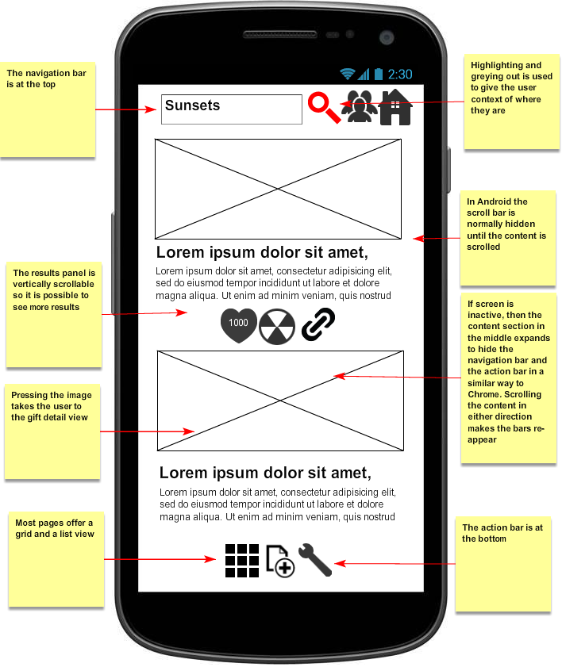

### Browsing

There are four types of views returning search results: 

- **query views**, shown in Figure 2 and 3, that either display the gifts with the highest number of votes if no search query has been entered, or gifts whose title match a specific query if a search query has been entered. The query is entered in the search box at the top of the page.
- **gift chain views**, shown in Figure 4 and 5, that display the gifts associated with a specific gift chain.
- **top gift giver view** that display the users who received the most number of votes for posting touching gifts
- **my gifts view** that displays the gifts created by the user.

The query views, gift chain views and my gifts views can be displayed either as a **list**, displaying the image, title and associated text, or as a **grid**, only displaying the image. The top gift giver view can only be displayed as a list. By default, the application returns the query list view shown in Figure 2 with an empty search query.

Only a subset of results (known as a **page**) are displayed at one time. A page consists of 20 results. Once the user scrolls beyond the page, the client will query the server to get the next page. The client will cache the pages using a content provider. The results are ordered either by the number of votes they have received (highest first) or by when they were published (most recent first). This is configurable in the user preference screen shown in Figure 12. The information required to populate a page, consisting of a list of gifts and their associated images are retrieved by a **background Service** in order to keep the UI responsive. The background Service will communicate with the activities via a **LocalBroadcastManager** rather than a **BroadcastReceiver** because it is more efficient and less likely to leak data.

The initial version of the application will not detect the type of connection in use e.g. WiFi, 3G etc.

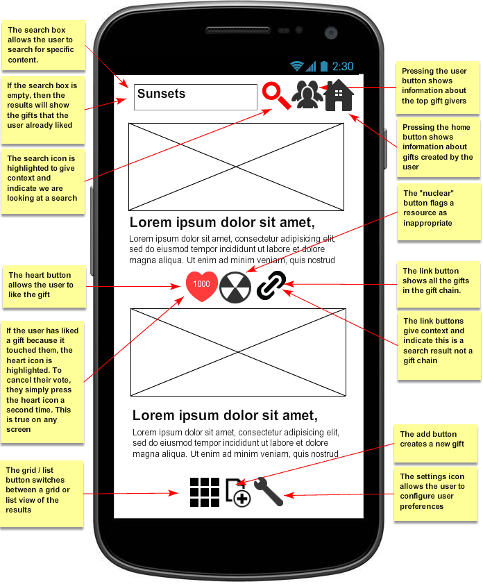

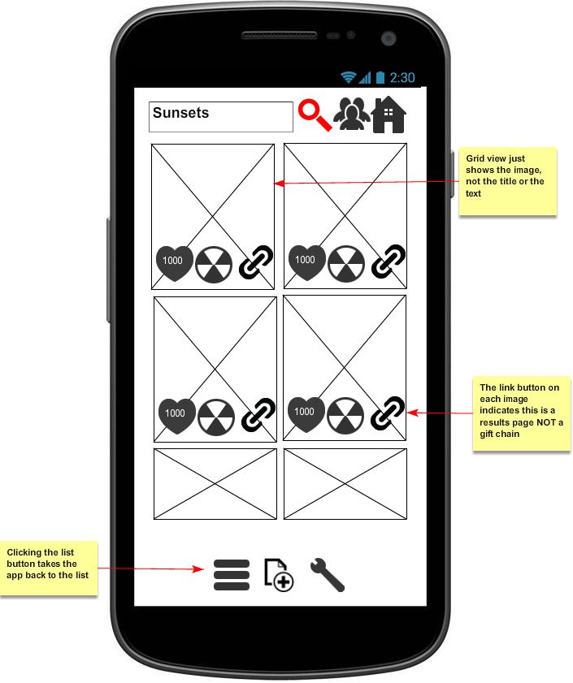

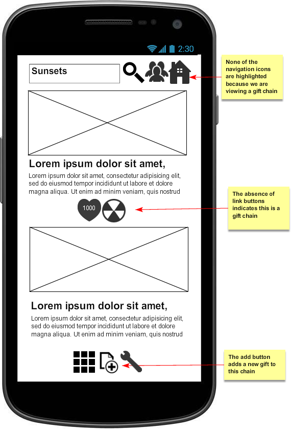

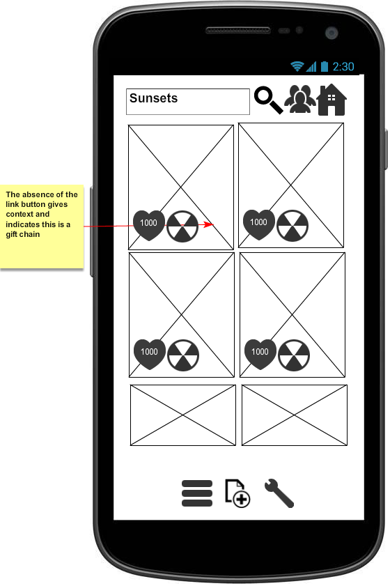

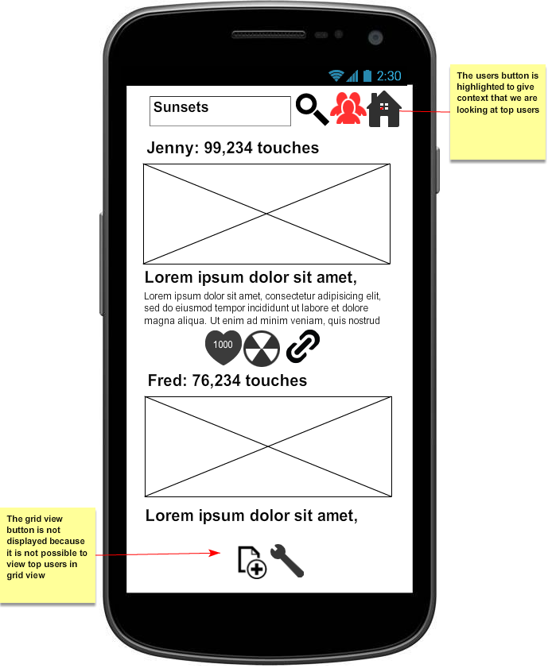

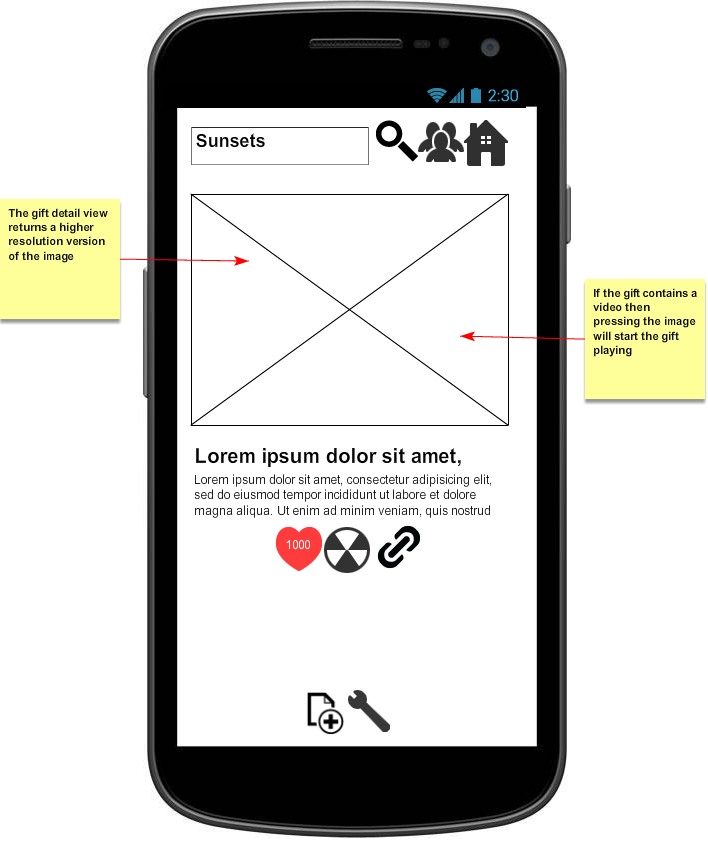

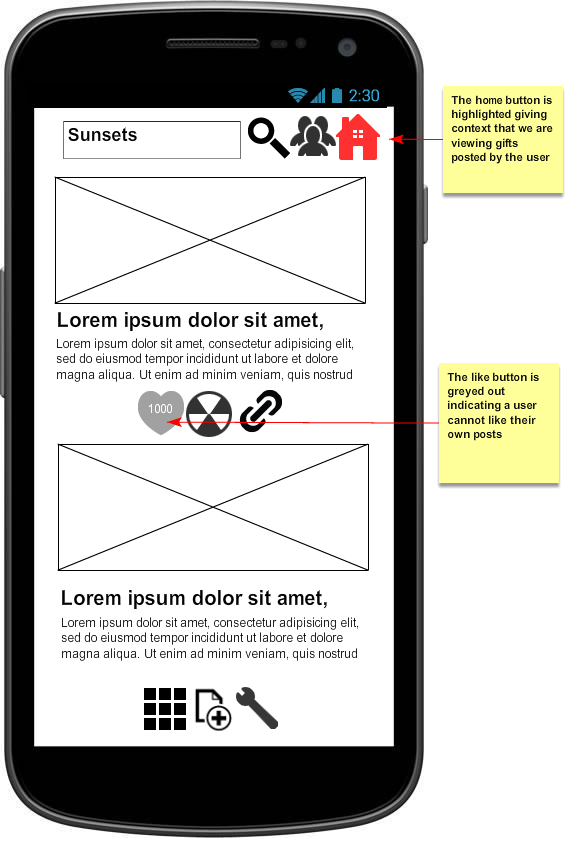

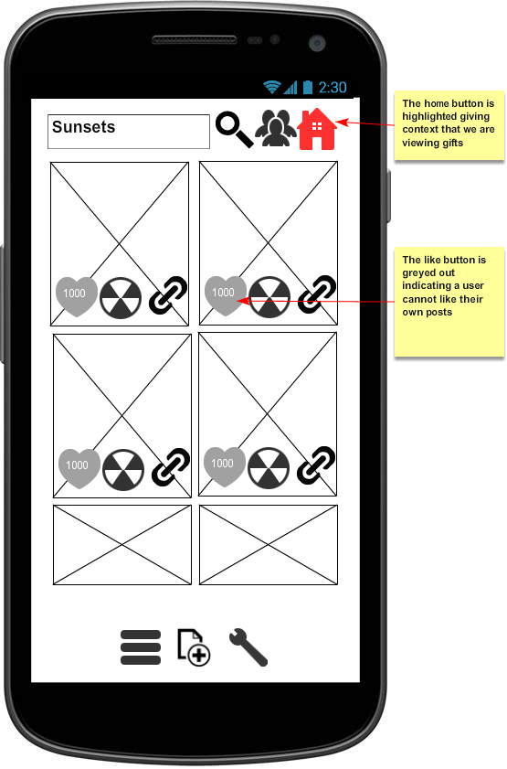

\newpage

### Interaction with gifts

If users are logged in, then they can vote for gifts that touched them and they can flag gifts as being inappropriate or obscene. If they vote for a gift or flag it, then the icon associated with that action becomes highlighted. To remove their vote or unflag a gift, they simply press the icon a second time and it will return to its normal colour. They cannot vote for or flag a gift they have created.

### Gift creation

Users create new gifts using Figure 10. If they came from a query view page (Figure 2 and 3), a top gift giver page (Figure 6) or a my gifts page (Figure 8 and 9) then when they complete the gift a new gift chain is automatically created and the gift is attached to this new chain. If they are on a gift chain page (Figure 4 and 5), then the new gift is attached to this existing gift chain. 

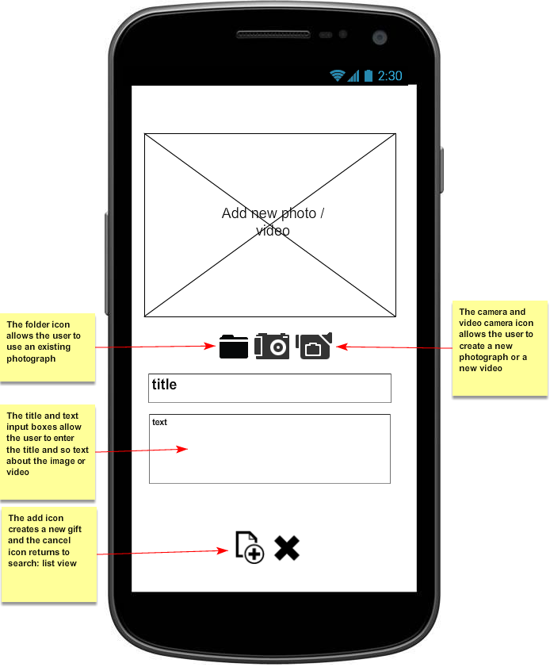

### Authentication

A user does not need to be logged in to see the query views, gift chain views or top gift giver views, but they do need to be logged to view their own gifts, to post new gifts, to vote that gifts touched them or flag gifts as inappropriate.

The login process (Figure 11) will the password grant flow in OAuth2. The server application will provide an authentication server. The user will enter their username and password into the client, and it will then send that information via HTTPS to the authentication server in order to get an OAuth token. This token has a finite lifetime and will be revoked when the user changes their password. The username, the userId and token will be stored securely on the client and will not be accessible by other applications. The password will not be stored on the client.

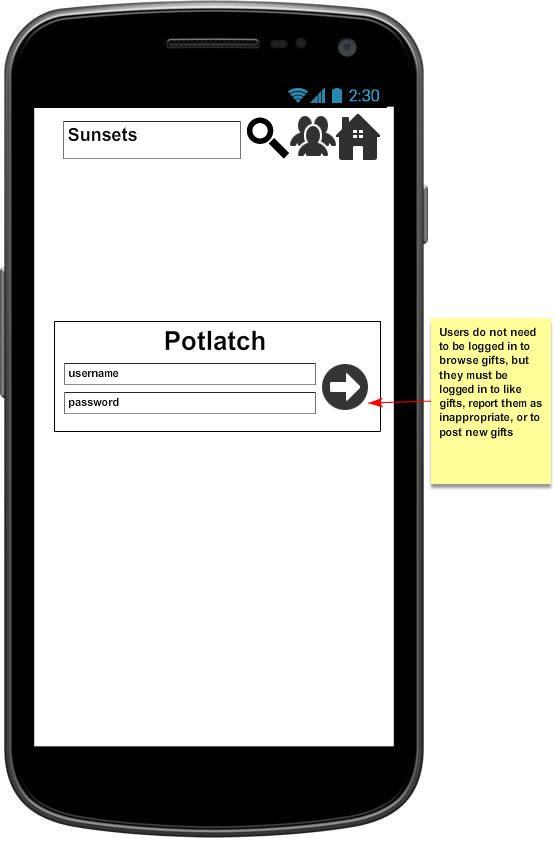

### User preferences

The user preference page allows users to select whether they want results being displayed ordered by the number of votes they have received or by order of creation. They can also select whether inappropriate or obscene content should be hidden. They can also modify their password.

The rubric for marking this assessment says that users should be able to configure the frequency that they see touch votes being updated: manual update (the user has to pull down the result list to force an update), every minute, every five minutes or every sixty minutes, so this is reflected in the Figure 12.

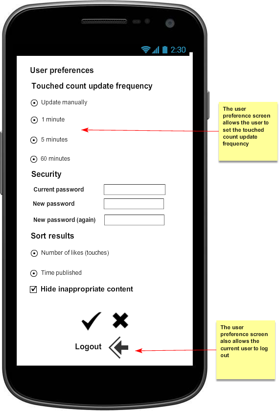

### Updating data

Updating touch votes at a specific frequency is quite difficult. One way to update the client is for the client to poll the server at a certain interval e.g. every minute, five minutes or every sixty minutes. However this creates additional load for the server, so in general the preferred way to do this is to use Android push notifications. Here if the state changes at the server, then the server sends a message to the client via an Android push notification. When the client receives the notification, it polls the server. Such an approach could be used to notify an application of the arrival of a new message, or on auction site to tell the user when they have been outbid.

However here the problem is how does the server determine what the user is interested in? Is it the gifts that they themselves have created? Is it the gifts that they have voted as touching them? Is it any gift that they happen to be viewing at that particular moment? Because in this application the focus of the user is changing all the time, using push notifications is not straightforward. Also, arguably, if the user is not actually using the application, getting these notifications might be undesirable as they are not that important to the user so they may only serve to reduce the battery life of the device.

Therefore here we propose that the initial version of the application will only support manual update of the number of touched votes. Once that version of the application works successfully, if there is time available, then the application will be extended to use updating via **app pull**. Here, if the Potlatch application is active, the client will poll this API at the configured interval. So we accept will that this approach may not be as efficient as server push, but we prefer it because it is easier for the client to determine what updates it requires if any rather server. 

## Server application

The server application will be written in Java using Spring. The client and the server applications communicate via HTTP or HTTPS when required, and the server provides a REST based interface that is queried by the client. The server supports multiple users via individual user accounts.

The gift data will be stored on the remote service. During browsing, a page of search results is returned at a time. Once the client has received search results for a specific view, it will cache them. The client can request both thumbnail and high resolution versions of images. If the user selects the detail view for a gift, then the client will retrieve a high resolution version of the image from the server. If the gift contains a video, then that will only be retrieved if the user presses the image in the detail view of the gift to initiating playing the video.

UML class diagrams for data model used by the server are shown in Figure 13 to Figure 17. The classes in the data model are:

- **Image**. This will store the location of the image on the filesystem.
- **Video**. This will store the location of the video on the filesystem.
- **Gift**. This represents a gift in the client app. This stores the **title**, the **optional text**, the **image** and the **optional video** associated with the gift.
- **ServerGift**. This is how a gift is stored on the server. It inherits from **Gift** but also stores the **userId** of the user who created the gift. Gift and ServerGift are shown in Figure 13.
- **GiftResponse** is an abstract class that represents the relationship between a gift and a user who has responded to it.
- **TouchingGift** extends GiftResponse and records that a user was touched by a gift.
- **InappropriateGift** extends GiftResponse and records that a user flagged that a gift was inappropriate or obscene. GiftResponse, TouchingGift and InappropriateGift are shown in Figure 14.
- **GiftMetadata** records metadata about a specific gift, including the number of users who have voted it touched them, and if any user has flagged it as being inappropriate as shown in Figure 15. 
- **GiftChainEntry** associates a gift with a specific chain as shown in Figure 16.
- **UserMetadata** associates a **userId** with a **username** and records the **total number of touched votes** received by that user as shown in Figure 17.

The server uses Spring repositories for persisting **ServerGift**s, **TouchingGift**s, **InappropriateGift**s, **GiftMetadata**, **UserMetadata** and **GiftChainEntries** in the database. Note user preferences are not persisted on the server but are stored in the client application.

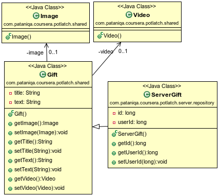

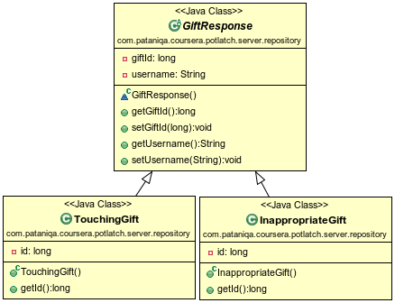

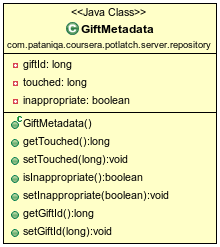

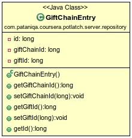

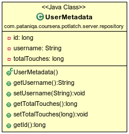

\newpage

## REST API design

The server provides the following REST endpoints that can be accessed by the client:

### Generate query views

This is used to retrieve gifts by title:

    GET /gift/search/findByName?title={title}&orderby={orderby}&order={order}
        &page={page}&hideInappropriate={boolean}

where `orderby` is `touch` or `created` and `order` is `ascending` or `descending` and page is an integer. `hideInappropriate` indicates whether to hide inappropriate or obscene content.

### Generate gift chain views

This is used to retrieve all the gifts associated with a particular gift chain:

    GET /giftchain/{giftchainId}?orderby={orderby}&order={order}&page={page}
        &hideInappropriate={boolean}

### Generate a list of top gift givers

This is used to retrieve a list of the top gift givers. Note here the response should contain metadata about the user and their most popular gift.

    GET /user?page={page}&hideInappropriate={boolean}

### Generate my gift views

This is implemented using a more general method that will retrieve the gifts of a specific user:

    GET /user/{user}?orderby={orderby}&order={order}&page={page}
        &hideInappropriate={boolean}

### Generate the default view

This retrieves all the gifts in the collection, paged, in the requested order:

    GET /gift?orderby={orderby}&order={order}&page={page}
        &hideInappropriate={boolean}

### Get an image associated with a gift

    GET /gift/{giftId}/image?quality={quality}

where `quality` is either `low` or `high`. If the quality parameter is not present, then by default it returns high.

### Get a video associated with a gift

    GET /gift/{giftId}/video

### Post gift metadata

This is used by the client to create a new gift: 

    POST /gift

The body is a JSON object containing the `title` and some optional text. **All** POST methods a user to be authorized.

### Post gift image

This is used by the client to post the image associated with a gift:

    POST /gift/{giftid}/image

Here the request contains a multipart body with the image associated with the gift.

### Post gift video

This is used by the client to post an optional video associated with a gift:

    POST /gift/{giftid}/video

Here the request contains a multipart body with the video associated with the gift.

### Change the touched status of a gift

This is used by the client to modify whether a user has been touched by a specific gift:

    PUT /gift/{giftid}/touch

PUT is used because the state of the gift is being modified.

### Change the inappropriate flag status of a gift

This is used by the client to modify whether a user has flagged a specific gift as inappropriate:

    PUT /gift/{giftid}/flag

### Request an OAuth token

This is used by the client to retrieve the OAuth token:

    GET /oauth/token

RFC6749 says the authorization server MUST support the use of the GET method and MAY support POST as well.

## Discussion

One of the reasons of producing a design document like this is to review the design and improve it prior to implementing it. How can this design presented in this document be further improved? 

- **Could the design be simplified?** This design is clearly based on design presented in the project requirements. That design used a list view for search and a grid view for gift chains. This had the advantage that is clearly provided context to the user. However it also seemed strange to offer such different views depending on the type of browsing. Therefore this design offers both list and grid views, but that increased the complexity to 11 activities.  
- **Could search and browse navigation be improved?** This project is similar to Facebook. One reason Facebook is compelling is we see the posts of our friends, so we are likely to be interested in them. Here, we have no notion of friendship, so we will not automatically be so interested in the gifts we see. 
- **Would it be better if we could switch between sorting results by number of touches and creation time directly on the search page, rather than via user preferences?**
- **Extend the application to support new user registration.** The example OAuth applications we developed in the Cloud services course used hardcoded usernames and passwords. This design does not consider how to go beyond this. In order to do this, we need to store usernames and passwords in a database on the server. Therefore care needs to be taken with the passwords i.e. they need to be encrypted and salted. The login page would also have to be modified to support new user registration.
- **Could clutter be removed from the UI?** Modern Google UIs use left and right swiping to avoid the need for icons cluttering up the display. Could this UI be adapted to use them? Flagging a resource in particular seems to require an icon as you want to avoid it happening by accident. Modern mobile UIs - both HTML and native - seem to be moving towards using a single icon at the top that contains menus or options. This removes clutter from the UI. Here however, we have two bars - a navigation bar at the top and an action bar at the bottom although the intention is to hide them. Could this be improved? 
- **How can we improve application performance to make the application more compelling?** One important factor in how compelling an application is how responsive it is. Uploading / downloading images is actually difficult - consider early versions of the Facebook app which could be quite unresponsive - because modern smartphones generate images that are between 2 and 4 megabytes in size. As typical connection speed might be between 1 to 5 MB/s, this means a single image can easily take 32 seconds or more to upload. Can we use transcoding to improve upload speed?
- **How will the application compare in terms of usability and implementation complexity to a native HTML design?** For example in a native HTML design, the grid or list views could be implemented using Javascript. What advantages does the app approach have other a native HTML design? How do we ensure the implementation has those advantages?
- **Support more form factors.** In the current design we only consider portrait mobile phones. It would be good to consider a design for a landscape mobile phone, and for a tablet. Because the tablet has a wider screen, it can cope with two activities on the screen at the same time. Is there anyway we could make use of this? 
- **Extend the current design to allow gifts to be created but not updated or deleted**.
